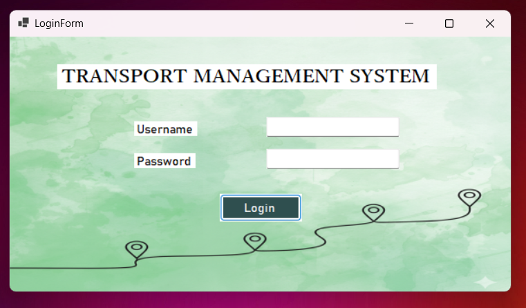

# 🚍 Transportation Management System

A desktop-based **Transportation Management System (TMS)** developed using **C# and .NET Windows Forms**. The system is designed to manage transportation operations including users, drivers, vehicles, routes, assignments, billing, records, and reports.

## Screenshots

### Login Screen



## 🚀 Features

* 🔐 User authentication and login
* 👨‍💼 Admin dashboard
* 👨‍💻 Staff dashboard
* 👥 User management
* 👨‍✈️ Driver management
* 🚗 Vehicle management
* 🛣️ Route management
* 🔗 Driver and vehicle assignment
* 🧾 Bill generation
* 📋 Record management
* 📊 Report viewing

## 🛠️ Technologies Used

* **C#**
* **.NET**
* **Windows Forms**
* **Microsoft SQL Server LocalDB**
* **Visual Studio**
* **Object-Oriented Programming (OOP)**

## 🗄️ Database

This application uses **Microsoft SQL Server LocalDB**.

```text
Database: TransportMS
Server: (localdb)\MSSQLLocalDB
Authentication: Windows Authentication
```

The application connects to the database using:

```text
Data Source=(localdb)\MSSQLLocalDB;
Initial Catalog=TransportMS;
Integrated Security=True
```

> **Note:** The database itself is not included in this repository. The application is configured to connect to a local SQL Server LocalDB instance.

## 🏗️ Project Structure

```text
TMS-FINAL
│
├── TMS-FINAL/
│   ├── Admin_Dashboard.cs
│   ├── Assign_Drivers.cs
│   ├── Assign_Vehicles.cs
│   ├── Generate_Bills.cs
│   ├── Login.cs
│   ├── Manage_Drivers.cs
│   ├── Manage_Routes.cs
│   ├── Manage_Users.cs
│   ├── Manage_Vehicles.cs
│   ├── Staff_Dashboard.cs
│   ├── View_Records.cs
│   ├── View_Reports.cs
│   ├── Program.cs
│   └── TMS-FINAL.csproj
│
├── TMS-FINAL.sln
├── .gitignore
└── README.md
```

## ⚙️ Getting Started

### Prerequisites

Before running the application, install:

* **Visual Studio**
* **.NET SDK** compatible with the project
* **Microsoft SQL Server LocalDB**

### 1. Clone the repository

```bash
git clone https://github.com/sa-minz/TMS-FINAL.git
cd TMS-FINAL
```

### 2. Open the project

Open the solution file:

```text
TMS-FINAL.sln
```

using **Visual Studio**.

### 3. Configure the database

Create or restore a SQL Server LocalDB database named:

```text
TransportMS
```

The application expects the SQL Server LocalDB instance:

```text
(localdb)\MSSQLLocalDB
```

The required database tables should be available before running the application.

### 4. Restore dependencies

Allow Visual Studio to restore the required .NET dependencies.

### 5. Build the project

In Visual Studio, select:

**Build → Build Solution**

### 6. Run the application

Press:

```text
F5
```

or select:

**Debug → Start Debugging**

## 💻 Application Modules

### 🔐 Login

Provides authentication before accessing the system.

### 👨‍💼 Admin Dashboard

Allows administrators to access management functions such as users, drivers, vehicles, routes, assignments, billing, records, and reports.

### 👨‍💻 Staff Dashboard

Provides staff members with access to relevant transportation management functions.

### 👥 User Management

Allows authorized users to manage system users.

### 👨‍✈️ Driver Management

Provides functionality for managing driver information.

### 🚗 Vehicle Management

Allows authorized users to manage transportation vehicles.

### 🛣️ Route Management

Provides functionality for managing transportation routes.

### 🔗 Driver & Vehicle Assignment

Allows drivers and vehicles to be assigned for transportation operations.

### 🧾 Bill Generation

Provides functionality for generating transportation-related bills.

### 📋 Records

Allows users to view and manage transportation records.

### 📊 Reports

Provides access to transportation-related reports and information.

## 🔐 Security

* Database authentication uses **Windows Authentication** through SQL Server LocalDB.
* No database username or password is hard-coded in the application.
* Visual Studio temporary files and build outputs are excluded using `.gitignore`.
* Local database files and environment files are excluded from Git.

## 📚 Purpose

This project was developed to gain practical experience in:

* C# desktop application development
* Windows Forms development
* Object-Oriented Programming
* Database-driven application development
* CRUD operations
* SQL Server database integration
* User authentication
* Role-based application functionality
* Software development

## 👩‍💻 Author

**Savinthi Abeygunawardena**

Software Engineering Undergraduate
LNBTI Japanese IT University
